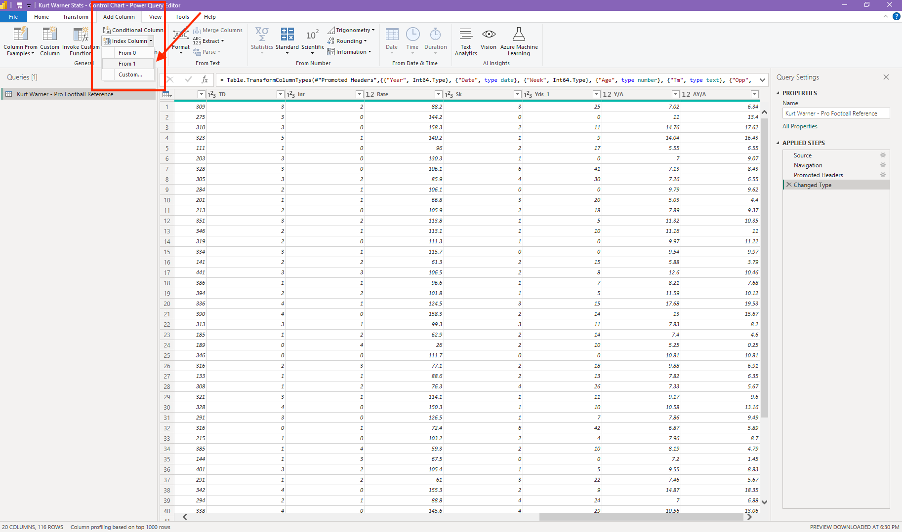
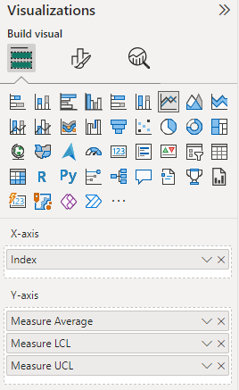
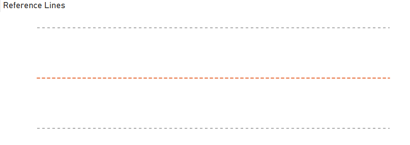

## Introduction

My company recently made the switch from Tableau to Power BI for our analytics and visualization platform. I have really enjoyed learning the platform so far. The current capabilities and future plans I've seen are really exciting. But one area that has been a struggle for me is control charts. These are a visual tool our group loves to use to track KPIs.

I first learned about control charts, a Lean Six Sigma staple, from a [great post](https://dataremixed.com/2011/09/tom-brady-and-control-charts-with-tableau/) from Ben Jones in their [DataRemixed blog](https://dataremixed.com). In the post he uses Tom Brady's game stats to introduce control charts and how to build them in Tableau. If you work in Tableau or just want to see some great data work, I highly recommend this post.

Unfortunately, I found building a similar viz in Power BI to be much more challenging. There are some add-ins you can use that people have created. But most require a license and/or don't have the customization options I am looking for. So, I started researching and testing and finally found a way to build what I was looking for. It took a lot of time, so I wanted to share this in case it can help anybody same some time.

**You can find a copy of my Power BI workbook here:** [Google Drive Resources](https://drive.google.com/drive/folders/1F63tmNQSSIaH6dxK_7b0jBsKmMIEAW7_?usp=share_link)

## Resources

I tend to learn best from reading through different documentation and how-tos and then doing some trial-and-error on my own projects. Here are the resources that really helped me in this build:
- [Towards Data Science Article by Natalie Garces](https://towardsdatascience.com/how-to-create-a-control-chart-in-power-bi-fccc98d3a8f9)
- [Excelerator BI Articel by Matt Allington](https://exceleratorbi.com.au/six-sigma-control-charts-in-power-bi/)
- [Shewhart Individuals Control Chart - Wikipedia](https://en.wikipedia.org/wiki/Shewhart_individuals_control_chart)

Combining the calculation and visualization setps in the articles from Natalie and Matt with the process guidance from Ben and the Wikipedia article, I decided to build a Power BI viz in honor of how I learned in Tableau. So, I built this using stats of one of my favorite quarterbacks: Kurt Warner.

**Data Source:** [Pro Football Reference](https://www.pro-football-reference.com/players/W/WarnKu00/gamelog/)

## Walkthrough

This will have quite a few steps, as I like to seperate each step in details.

### Optional Data Setup


The following steps are optional depending on how your raw data is structured. In my testing, the simplest method to build these charts is to summarize your data down to one row per timeframe or x-axis instance, for me this is each game.

1. Add an Index Row
    a. If you aren't planning to use a date field for your x-axis, you can add an index in the "Edit Query" window. You can navigate to this by clicking "Transform Data" upon import or right-clicking on your table in the data model view.
    

2. Add Calculated Columns
    a. If you want to plug a metric into your control chart that isn't in your raw data, be sure to calculate it as a column.
    b. If it's a ratio, you could do this after step three, but if it is something like charges-discounts=net sales, you can do that here.

3. Create a Summary Table
    a. This is the step I have found to really simplify the process. I don't technically need to do it as my NFL data is already one row per game, but I will do it here for the sake of the example.
    b. In the data view, under the Home ribbon, click "New Table" and adapt this code:

    ```
    summary_table = 
    SUMMARIZECOLUMNS (
        'Kurt Warner - Pro Football Reference'[Index],
        'Kurt Warner - Pro Football Reference'[Date],
        'Kurt Warner - Pro Football Reference'[Opp],
        'Kurt Warner - Pro Football Reference'[H/A],
        --[ADD MORE SUMMARIZE COLUMNS HERE],
        --FILTER('Kurt Warner - Pro Football Reference', 'Kurt Warner - Pro Football Reference'[H/A] = "H"), --can add filter here
        "Yards", SUM('Kurt Warner - Pro Football Reference'[Yds]) --expression to return grouped yards
    )
    ```

If you do want to track a calculated ratio, you could add it to this summarized table to make it a clean metric per day, or game in my example. As you can see in my formula, I am going to keep things simple and just pull over the yards stat to visualize.

**Here is my summarized table:**


### Add New Columns

These are the columns necessary to drive our control chart calculations.

1. Prior Period Amount
    a. We use this to calculate the moving range
    ```
    Prior Game Yards = 
        CALCULATE(
            SUM(summary_table[Yards]),
            FILTER('summary_table',summary_table[Index]=EARLIER(summary_table[Index])-1) --filter to prior index value to grab value
        )
    ```

2. Moving Range
    ```
    Moving Range = 
        if(summary_table[Index]<=1,0, --ignore the first record
        ABS(summary_table[Yards]-summary_table[Prior Game Yards])
    )

    //calculate the absolute difference between the current game and the prior game yards
    ```

3. Prior Period Moving Range
    ```
    Prior Game Moving Range = 
        CALCULATE(
            SUM(summary_table[Moving Range]),FILTER('summary_table','summary_table'[Index]=EARLIER('summary_table'[Index])-1)
        )
    ```

**Here is my table with these added columns:**


### Calculate Control Chart Measures

With those new fields added, it's now time for a rapid fire of new measures. There are likely ways to combine some of these calculations, but I like to seperate each to try to better understand the creation steps. You will see me call anything for the raw metric with a "Measure" prefix. Anything for the moving range will have a "Moving Range" prefix.

1. Index Value

    ```
    Index Value = 
        CALCULATE(
            MAX('summary_table'[Index]),FILTER('summary_table','summary_table'[Index]='summary_table'[Index])
        )

    //using this as measures are more restrictive in which values/fileds you can use to filter.
    ```

2. Measure Average

    ```
    Measure Average = 
        CALCULATE(
            AVERAGEX('summary_table',summary_table[Yards]),
            ALLSELECTED('summary_table')
        )

    //This is a window average for the control chart stat that will update based on filters.
    ```

3. Moving Range Average

    ```
    Moving Range Average = 
        CALCULATE(
            AVERAGEX('summary_table',summary_table[Moving Range]),
            ALLSELECTED('summary_table')
    )

    //Window average for our moving range.
    ```

4. Measure Upper Control Limit (UCL)

    ```
    Measure UCL = [Measure Average] + 3*[Moving Range Average]/1.128

    //Calculate the upper control limit using Shewhart's standards
    ```

5. Measure Lower Control Limit (LCL)

    ````
    Measure LCL = [Measure Average] - 3*[Moving Range Average]/1.128

    //Calculate the lower control limit using Shewhart's standards
    ````

6. Measure Trend Indicator

    ```
    Measure Trend Indicator = 
        IF([Index Value] <= 1,0,
        IF(sum(summary_table[Yards])-sum(summary_table[Prior Game Yards])>0,1,
        IF(sum(summary_table[Yards])-sum(summary_table[Prior Game Yards])<0,-1,
        0)))

    //check the direction in which the measure moved from the prior day. Flag as 1=up, -1=down, 0=same
    ```

7. Measure Trend Pseudo Tracker

    ````
    Measure Trend Pseudo Tracker = 
        VAR CurrentIndex = CALCULATE(max('summary_table'[Index]),FILTER('summary_table','summary_table'[Index]='summary_table'[Index]))
        VAR CurrentTrend = CALCULATE([Measure Trend Indicator],FILTER('summary_table','summary_table'[Index]='summary_table'[Index]))
        RETURN
        CALCULATE (
            COUNTROWS('summary_table'),
            FILTER (
                ALLSELECTED('summary_table'),
                'summary_table'[Index] > CurrentIndex - 7
                && 'summary_table'[Index] <= CurrentIndex
                && [Measure Trend Indicator] = CurrentTrend
            )
        )

    //count up the values in the previous six rows that match the direction of the trend on the current row. If it's 7 (including that row) that's a psuedo 7 day trend even if it isn't a true running count.
    ````

8. Measure Above Control Line (CL)

    ```
    
    ```

9. Measure Upshift Pseudo Tracker

    ```
    Measure Upshift Pseudo Tracker = 
        IF(
        [Measure Above CL]=0, 0,
        VAR CurrentIndex = CALCULATE(MAX('summary_table'[Index]),FILTER('summary_table',summary_table[Index]=summary_table[Index]))
        RETURN
            CALCULATE(
                COUNTROWS('summary_table'),
                FILTER(
                    ALLSELECTED('summary_table'),
                    summary_table[Index] > CurrentIndex-7
                    && summary_table[Index] <= CurrentIndex
                    && [Measure Above CL] = 1
                )
            )
        )

    //Count the rows in the 7 rows up to the current rows that are above the Control Line (Window Avg). If it is 7 that is a psuedo 7-days in a row, equally an upshift.
    ```

10. Measure Below Control Line (CL)

    ```
    
    ```

11. Measure Downshift Pseudo Tracker

    ```
    Measure Downshift Pseudo Tracker = 
        IF(
        [Measure Below CL]=0, 0,
        VAR CurrentIndex = CALCULATE(MAX('summary_table'[Index]),FILTER('summary_table',summary_table[Index]=summary_table[Index]))
        RETURN
            CALCULATE(
                COUNTROWS('summary_table'),
                FILTER(
                    ALLSELECTED('summary_table'),
                    summary_table[Index] > CurrentIndex-7
                    && summary_table[Index] <= CurrentIndex
                    && [Measure Below CL] = 1
                )
            )
        )

    //Count the rows in the 7 rows up to the current rows that are below the Control Line (Window Avg). If it is 7 that is a psuedo 7-days in a row, equally a downshift.
    ```

### Calculate Moving Range Measures

This will have most of the same elements, but aimed at the moving range.

1. Moving Range Upper Control Limit (UCL)

    ```
    
    ```

2. Moving Range Trend Indicator

    ```
    Moving Range Trend Indicator = 
        IF([Index Value] <= 1,0,
        IF(sum(summary_table[Moving Range])-sum(summary_table[Prior Game Moving Range])>0,1,
        IF(sum(summary_table[Moving Range])-sum(summary_table[Prior Game Moving Range])<0,-1,
        0)))

    //check the direction in which the moving range moved from the prior day. Flag as 1=up, -1=down, 0=same
    ```

3. Moving Range Trend Pseudo Tracker

    ```
    Moving Range Trend Pseudo Tracker = 
        VAR CurrentIndex = CALCULATE(max(summary_table[Index]),FILTER('summary_table',summary_table[Index]=summary_table[Index]))
        VAR CurrentTrend = CALCULATE([Moving Range Trend Indicator],FILTER('summary_table',summary_table[Index]=summary_table[Index]))
        RETURN
        CALCULATE (
            COUNTROWS('summary_table'),
            FILTER (
                ALLSELECTED('summary_table'),
                summary_table[Index] > CurrentIndex - 7
                && summary_table[Index] <= CurrentIndex
                && [Moving Range Trend Indicator] = CurrentTrend
            )
        )

    //count up the values in the last seven days that match the direction of the trend on the current date. If it's 7 that's a psuedo 7 day trend even if it isn't a true running count.
    ```

4. Moving Range Above CL

    ```
    Moving Range Above CL = IF(sum(summary_table[Moving Range])>[Moving Range Average],1,0)
    ```

5. Moving Range Upshift Pseudo Tracker

    ```
    Moving Range Upshift Pseudo Tracker = 
        IF(
        [Moving Range Above CL]=0, 0,
        VAR CurrentIndex = CALCULATE(MAX(summary_table[Index]),FILTER('summary_table',summary_table[Index]=summary_table[Index]))
        RETURN
            CALCULATE(
                COUNTROWS('summary_table'),
                FILTER(
                    ALLSELECTED('summary_table'),
                    summary_table[Index] > CurrentIndex-7
                    && summary_table[Index] <= CurrentIndex
                    && [Moving Range Above CL] = 1
                )
            )
        )

    //Count the rows in the 7 days up through the current row date that are above the Control Line (Window Avg). If it is 7 that is a psuedo 7-day trend, even if it isn't a true running count.
    ```

6. Moving Range Below CL

    ```
    Moving Range Below CL = IF(sum(summary_table[Moving Range])<[Moving Range Average],1,0)
    ```

7. Moving Range Downshift Pseudo Tracker

    ```
    Moving Range Downshift Pseudo Tracker = 
        IF(
        [Moving Range Below CL]=0, 0,
        VAR CurrentIndex = CALCULATE(MAX(summary_table[Index]),FILTER('summary_table',summary_table[Index]=summary_table[Index]))
        RETURN
            CALCULATE(
                COUNTROWS('summary_table'),
                FILTER(
                    ALLSELECTED('summary_table'),
                    summary_table[Index] > CurrentIndex-7
                    && summary_table[Index] <= CurrentIndex
                    && [Moving Range Below CL] = 1
                )
            )
        )

    //Count the rows in the 7 days up through the current row date that are below the Control Line (Window Avg). If it is 7 that is a psuedo 7-day trend, even if it isn't a true running count.
    ```

### Calculate Signals

This is my favorite part of these charts, and the reason why we added so many measures. These are visual indicators to help your viewers seperate the signals from the noise.

1. Measure Signal

    ```
    Measure Signal = 
        IF(sum(summary_table[Yards]) > [Measure UCL], "Outlier",
        IF(sum(summary_table[Yards]) < [Measure LCL], "Outlier",
        IF([Measure Trend Pseudo Tracker]>=7,"Trend",
        IF([Measure Downshift Pseudo Tracker]>=7,"Shift",
        IF([Measure Upshift Pseudo Tracker]>=7,"Shift",
        "In Range")))))
    ```

2. Measure Signal Description

    ```
    
    ```

3. Moving Range Signal

    ```
    Moving Range Signal = 
        if(sum(summary_table[Moving Range]) > [Moving Range UCL], "Outlier",
        if([Moving Range Trend Pseudo Tracker]>=7,"Trend",
        if([Moving Range Upshift Pseudo Tracker]>=7,"Shift",
        if([Moving Range Downshift Pseudo Tracker] >=7,"Shift",
        "In Range"))))
    ```

4. Moving Range Signal Description

    ```
    Moving Range Signal Description = 
        if([Moving Range Signal] = "Outlier", "The value was above the upper control limit.",
        if([Moving Range Signal] = "Trend", "7 values in a row trended in the same direction.",
        if([Moving Range Signal] = "Shift", "7 values in a row were above the control line or below the control line.",
        if([Moving Range Signal] = "In Range", "The value was within the normal range."))))
    ```

Phew! That was a lot of measures. Like I said there may be some opportunity to simplify, and I'd love to hear your suggestions so please let me know! But for now, we're setup for creating visuals. :)

### Create Control Charts

I want to give a huge shoutout here to Natalie here. I used her same methodology of stacking visualizations to get the custom look I want. As of right now, this is the only way I have been able to get this view to work is by layering the charts with the actual results layered on top of a reference lines chart. To get the stacked control chart and moving range views you saw in the header, we'll break the viz down into 4 parts.

#### Measure Reference Lines

In this viz, we will add the window average, LCL, and UCL lines before making the rest of the chart components invisible.

1. Add a line graph to your dashboard.

2. Add the *Measure Average*, *Measure UCL*, and *Measure LCL* field to the Y-axis & the *Index (or date field)* to the X-axis.


3. Customize Line Formatting

You can have a lot of fun with this part. I like to have my UCL and LCL be 1pt width, dashed, in a grey color and my window average to be 2pt width, dashed, with an orange color.

Here is an example from my average line formatting:


Your viz should look something similar to this:


4. Now, because we need to stack 2 vizzes together, I like to make these changes to really only show the reference lines themselves:
    - Remove the Legend
    - Change the x-axis & y-axis title and values to white text (make invisible)
    - Remove the gridlines if you want to, I will

Please note, you can also change the chart title settings. What matters most is that the settings match for this and the next chart. I like to simply rename it as "Reference Lines."

Once I do this, my chart looks like this. The proportions are still the same, but the added detail is invisible.


#### Measure Control Chart

The approach here gets a little weird, so bear with me. :) I like to build my control chart with the markers changing colors based on if they are "In Range" or have a signal. To do this, you actually need to start with a bar chart.

1. Add a bar chart to your dashboard